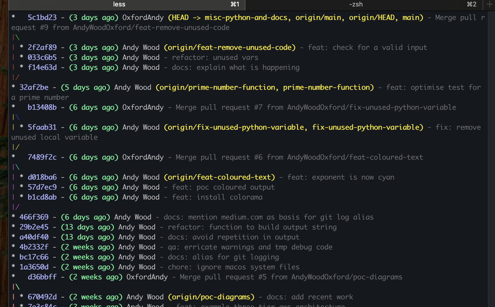

# utils

A nascaent collection of utility tooling.

### coloured-text.bash
A collection of macros and functions that support the output of coloured text.

### bash-template.sh
A template shell script with scaffolding for optional and mandatory arguments, signal
trapping etc. Uses the `coloured-text.bash` code.

### ssm.sh
Connect to AWS EC2 instances using this wrapper to AWS Systems Manager SSM agents. Access is controlled by
IAM permissions and not via an `ssh` key and firewalling rules.
See the [installation instructions for the Session Manager plugin](https://docs.aws.amazon.com/systems-manager/latest/userguide/session-manager-working-with-install-plugin.html).

## Python
A collection of common but simple mathematical algorithms that are helping me to learn Python:
* [factorial_loop.py](./python/factorial_loop.py) - factorial (using a for-loop)
* [factorial_recursion.py](./python/factorial_recursion.py) - factorial (using recursion)
* [prime_factors.py](./python/prime_factors.py) - prime factoring
* [birthday-paradox.py](./python/birthday-paradox.py) - the "birthday paradox"
* [concept2_erg_stats](./concept2_erg_stats.py) - Concept 2 rowing ergometer numbers
* [diagram_as_code.py](./python/diagram_as_code.py) - creating AWS diagrams


## Appendix
Pretty git logging :-)
Based on an alias in an article on [Medium.com by Jacob Bennet](https://levelup.gitconnected.com/use-git-like-a-senior-engineer-ef6d741c898e).

```shell
alias glog='git log --graph --format=format:'\''%C(bold blue)%h%C(reset) - %C(bold green)(%ar)%C(reset) %C(white)%an%C(reset)%C(bold yellow)%d%C(reset) %C(dim white)- %s%C(reset)'\'' --all'
```

 

